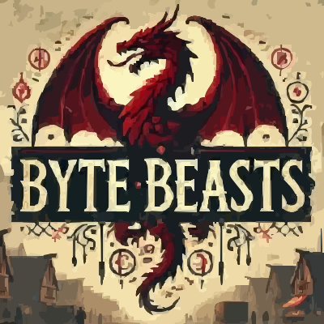

<picture>
  <source media="(prefers-color-scheme: dark)" srcset=".github/mark-dark.svg">
  
</picture>

<a href="https://x.com/0xByteBeasts">

</a>
<a href="https://x.com/0xByteBeasts">

</a>


[![Telegram Chat][tg-badge]][tg-url]

[tg-badge]: https://img.shields.io/endpoint?color=neon&logo=telegram&label=chat&style=flat-square&url=https%3A%2F%2Ftg.sumanjay.workers.dev%2Fdojoengine
[tg-url]: https://t.me/+-84e2pqLtqNkZDAx


# Byte Beasts: Official Guide 🐉🎮

The official Byte Beasts guide, the quickest and most streamlined way to get your Dojo provable game up and running. This guide will assist you with the initial setup, from cloning the repository to deploying your world.

Read the full tutorial [here](https://book.dojoengine.org/tutorial/dojo-starter).

## Prerequisites 📋

To be able to run the ByteBeasts backend you need to have Git, Rust and Scarb installed on your PC to satisfy Dojo dependencies. You can install them with the following steps:

### Install Rust 🦀

Go to the [Rust installation page](https://doc.rust-lang.org/book/ch01-01-installation.html#installing-rustup-on-linux-or-macos)

After installing Rust, ensure your `PATH` environment variable includes the Cargo bin directory (usually `$HOME/.cargo/bin`).

### Install Git 🧑‍💻
Go to the [Git installation page](https://git-scm.com/downloads) and follow the instructions for your operating system to install Git.

### Install Scarb ⚙️
The Dojo toolchain integrates [Scarb](https://docs.swmansion.com/scarb/) to build and run Dojo projects, installation instructions are [here](https://docs.swmansion.com/scarb/download.html).

### Install Dojo using `dojoup` 🥋

You can install with the `dojoup` version manager which enables you to easily install, update and manage your Dojo installation.

### Install dojoup 🛠️
```bash
curl -L https://install.dojoengine.org | bash
```
### Install the Dojo v1.0.0-alpha.5 release 🚀

### Install Dojo using `asdf` 📦

You can alternatively use the `asdf` package manager to install and manage your Dojo installation.

### Install asdf

Follow the [asdf installation instructions](https://asdf-vm.com/guide/getting-started.html)

### Add the asdf-dojo plugin 🔌

```bash
asdf plugin add dojo https://github.com/dojoengine/asdf-dojo
```

### Install the latest or a specific version 🆕

```bash
asdf install dojo latest      # For the latest version
asdf install dojo 0.7.0       # For a specific version

```

### Set the global or local version  📁

```bash
asdf global dojo latest       # Set globally
asdf local dojo 0.7.0         # Set locally in your project directory

```

## Running Locally 🖥️

### Terminal one (Make sure this is running) 🏃
```bash
# Run Katana
katana --disable-fee --allowed-origins "*"
```

### Terminal two 🔄
```bash
# Build the example
sozo build

# Migrate the example
sozo migrate apply

# Start Torii
torii --world 0x70835f8344647b1e573fe7aeccbf044230089eb19624d3c7dea4080f5dcb025 --allowed-origins "*"
```

## Contribution 🤝

We welcome contributions from developers of all levels! If you're interested in contributing to this project, please follow our  [CONTRIBUTION GUIDELINES](./CONTRIBUTION.md) to get started.

Whether it's fixing bugs, improving documentation, or adding new features, your help is greatly appreciated. Don't hesitate to ask questions or reach out for support—we're here to help!


## Communication channel 📢
If you're a contributor or would like to connect with the project maintainers, feel free to join our [Telegram](https://t.me/+-84e2pqLtqNkZDAx) group!

